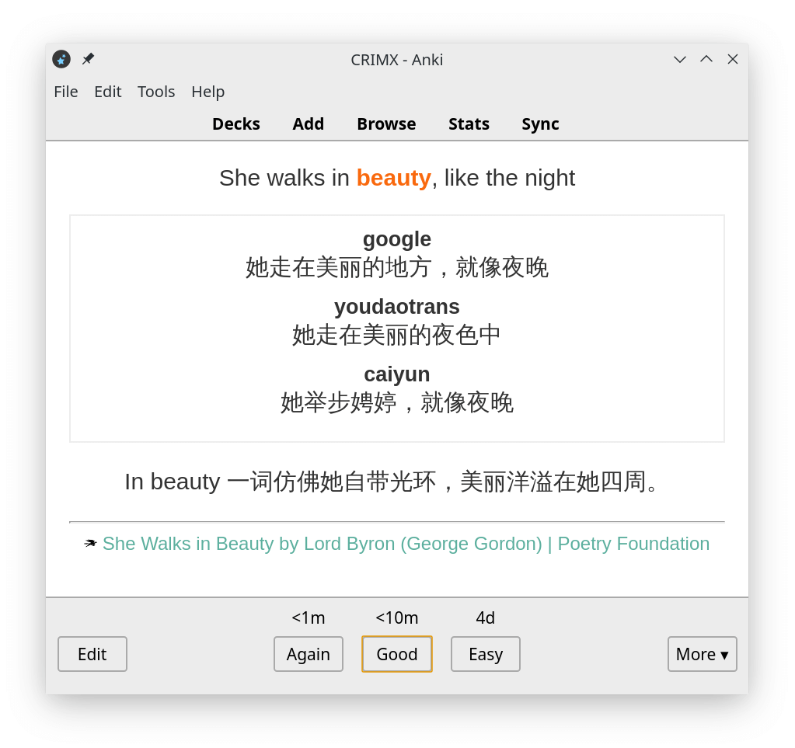

# 如何配合 Anki 使用

首先，如果不清楚 Anki 的基本概念和设计理念，可以参考这个[笔记](https://blog.crimx.com/2016/03/20/understanding-anki/)。

许多人疑惑添加生词为何不自动添加翻译（现已提供了上下文翻译）。与其它词典不一样，本扩展添加生词的方式是基于 Anki 和 SuperMemo 理念设计的，认为**添加生词的过程也是记忆的一个环节**。这刻意与当前流行的“尽可能省事”的设计相抵触，以避免迷失在信息流的漩涡中，产生“收藏既获得”的错觉。

**如果这不符合你的理念，可以在设置中关闭红心打开编辑窗口。**

从 v7.13.0 开始，沙拉查词支持 Anki Connect 自动制卡，原有的文本导出依然可以使用。

## Anki Connect 自动制卡

首先需要安装 [Anki Connect](https://github.com/FooSoft/anki-connect) 插件。

1. Anki 菜单栏中找到 工具/Tools 👉 插件/Add-ons 👉 浏览与安装/Browse & Install。
2. 输入 [`2055492159`](https://ankiweb.net/shared/info/2055492159) 确认安装。
3. 重启 Anki。

Windows 可以会出现防火墙提示，需要允许 Anki。Mac OS X Mavericks 可能需要调整 App Nap 以避免 Anki 被休眠，具体说明见[文档](https://github.com/FooSoft/anki-connect#notes-for-windows-users)。

安装之后如果没有特殊要求使用默认配置即可，在沙拉查词设置 👉 单词管理/Notebook 中开启 Anki Connect 同步。

开启之后请保持 Anki 在后台运行。另外可以安装插件 [`85158043`](https://ankiweb.net/shared/info/85158043) 让 Anki 最小化到系统托盘。每次保存单词到生词本的时候沙拉查词会自动制卡并同步到 Anki。相同的单词（以“Date”为准）会被跳过，如需强制更新可以在单词编辑器中更新。

例如如单词：

```yml
时间截: 1234567890
单词: beauty
上下文: >
  She walks in beauty, like the night
翻译: >
  [:: google ::]
  她走在美丽的地方，就像夜晚
   
  [:: youdaotrans ::]
  她走在美丽的夜色中
   
  [:: caiyun ::]
  她举步娉婷，就像夜晚
  ---------------
笔记: >
  In beauty 一词仿佛她自带光环，美丽洋溢在她四周。
来源标题: >
  She Walks in Beauty by Lord Byron (George Gordon) | Poetry Foundation
来源链接: >
  https://www.poetryfoundation.org/poems/43844/she-walks-in-beauty
来源图标: >
  https://www.poetryfoundation.org/assets/media/images/favicon-32x32.png?v=1.2.9
```

在保存到 Anki 后会成为

```yml
Date: 1234567890
Text: beauty
Context: >
  She walks in beauty, like the night
ContextCloze: >
  She walks in {{c1::beauty}}, like the night
Translation: >
  <div class="trans"><span class="trans_title">google</span><div class="trans_content">她走在美丽的地方，就像夜晚</div><span class="trans_title">youdaotrans</span><div class="trans_content">她走在美丽的夜色中</div><span class="trans_title">caiyun</span><div class="trans_content">她举步娉婷，就像夜晚</div></div>
Note: >
  In beauty 一词仿佛她自带光环，美丽洋溢在她四周。
Title: >
  She Walks in Beauty by Lord Byron (George Gordon) | Poetry Foundation
Url: >
  https://www.poetryfoundation.org/poems/43844/she-walks-in-beauty
Favicon: >
  https://www.poetryfoundation.org/assets/media/images/favicon-32x32.png?v=1.2.9
Audio: ''
```

其中这些 `Date`, `Text`, `Context`, `ContextCloze`, `Translation`, `Note`, `Title`, `Url`, `Favicon`, `Audio` 为 Anki 的笔记域“Note fields”，如果想自定义卡片请不要更改这些名字，而是直接添加新的卡片类型。Anki 的杀手锏之一便是笔记与卡片分离，见前文概念资料。

同时我们可以注意到这些名字与前面沙拉单词基本一一对应，但是多了 `ContextCloze` 和 `Audio`。其中 `Audio` 为待实现的发音功能；而 `ContextCloze` 仔细看它的值，关键字 `beauty` 被沙拉查词替换成了 <code v-pre>{{ c1::beauty }}</code>，这是用于生成 Anki 填空卡片。原有的上下文依然保留到 `Context` 方便用户自行制作其它卡片。

结合沙拉查词默认生成的填空题卡片样式，可以得到以下效果：


其中关键字被自动挖空；自动生成的翻译已同时自动排好版；个人笔记被作为提示隐藏起来，点击即可展开；来源保留在下方。

卡片背面：




## 文本方式导入

Anki 同时支持以文本方式导入笔记，但如果能用 Anki Connect 还是建议使用 Anki Connect 更方便。

### Note Type

第一次导入前我们需要在 Anki 中新建 note type，内置的只有正反面 Question 和 Answer ，如果觉得够用也可以。

1. 点开 `Tools -> Manage Note Types` 浏览所有 note types ，点 `Add` 添加。
1. 高级的可自行选择，这里我们选最基础的 `Add: Basic`。
1. 填写名字，如 Saladict Notebook。
1. 然后看到列表中添加成功了，选中，点击 `Fields` 编辑字段。
1. 可以看到默认只提供了 `Front` 和 `Back` ，全部删掉或直接改名，根据需要换成 Saladict 的几个字段 `Word`, `Context`, `Translation`, `Note`, `Source Title`, `Source URL`, `Source Favicon`。这里我们按顺序添加 `Word`, `Context`, `Translation`, `Note`。
1. Anki 会提示下次同步将完全覆盖，如果没有其它设备尚未同步，点确认。
1. 添加完后 `Close` 回到列表。点开 `Cards` 编辑卡片模板。
1. 可以看到卡片模板分为前后。根据需要填写，`{{}}` 中的就是我们刚才填写的字段，会被自动替换为具体内容。提供一个简单的模板：
   - Front Template:
     ```html
     <p>{{Word}}</p>

     <p>{{Context}}</p>

     ```
   - Back Template
     ```html
     {{FrontSide}}

     <hr id=answer>

     <p>{{Translation}}</p>

     <p>{{Note}}</p>

     ```
1. 填写完 `Close` 掉。Note types 添加完毕。

### 导出单词

在 Saladict 生词本或者查词记录中导出单词，可导出选中或全部导出。Anki 会自动识别重复的。

导出时编写模板，根据上面 Note Type 字段的顺序导出，用 <kbd>1</kbd> 左边的 ``` ` ``` 分割可以很好避免字符冲突。

比如按照上面例子的顺序 `Word`, `Context`, `Translation`, `Note`，我们的模板应该为

```
%text% ` %context% ` %trans% ` %note%
```

同时因为 Anki 文本导入是以行为单位识别的，导出的内容中有多行（如自动翻译会产生多行内容）注意将改选编辑器上方的「保留换行」。

- 可以选为`换行替换为空格`，导出的文本将没有换行。
- 可以改选为`换行替换为<br>` 或 `换行替换为<p>`。这是 Anki 可以识别的 HTML 标签（见下方配置）。在默认的样式下每行间 `<br>` 会比 `<p>` 更紧凑些。

导出保存文件。

### 导入单词

打开 Anki -> File -> Import 选择文件，导入类型选 `Text separated by tabs or semicolons`。

然后出现 Import 面板。几个选项：

- `Type` 就是上面的 Note Type ，选择 Saladict Notebook 。
- `Deck` 是让卡片如何归类，通过 `::` 分割层级结构。点开后可以选择已有的也可以 `Add` 新建。这里我们新建一个 `单词::Saladict` 。
- `Fields separated by: Space` 。我们换成 ``` ` ``` 。
- 然后就是忽略规则，按需选择。这里我们保持默认。
- `Allow HTML in fields` 。如果上面选择了 `<br>` 或 `<p>` 等 HTML 排版需要勾选。
- 然后下面的 `Field Mapping` 字段映射就可以看到识别到了上面定义的四个字段。两者匹配成功。
- 点击 `Import` 可以看到导入结果。
